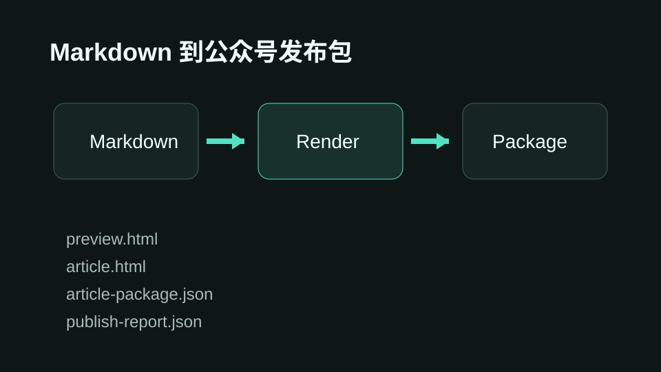

# 新 AI 工具值不值得进工作流，看这 6 个问题

很多人看到一个新 AI 工具，第一反应是收藏。

但真正的问题不是“这个工具厉不厉害”，而是：

> 它能不能进入你的稳定工作流。

如果一个工具只能在演示里跑通，不能被复用、不能被检查、不能降低交付成本，它就只是一次新鲜感。

## 1. 它解决的是高频问题吗？

低频问题不值得优先工具化。

你可以先问三个问题：

- 这个动作每周会出现几次？
- 每次会消耗多少时间？
- 不做自动化会不会影响交付质量？

## 2. 它是否降低了判断成本？

好的 AI 工具不只是更快，还应该让判断更清楚。

```txt
输入：一篇 Markdown 发布稿
处理：渲染、检查、复制图片、生成发布包
输出：HTML 预览 + article-package.json + publish-report.json
```

## 3. 它能否留下可复用资产？

| 判断项 | 好工具 | 坏工具 |
|---|---|---|
| 输出 | 可复用文件 | 一次性结果 |
| 过程 | 可追踪 | 只能凭感觉 |
| 失败 | 有错误报告 | 失败原因不清楚 |



## 结论

新工具进入工作流之前，先让它通过一个很朴素的测试：

**它是否能稳定产出作品、流程和可复用资产。**
